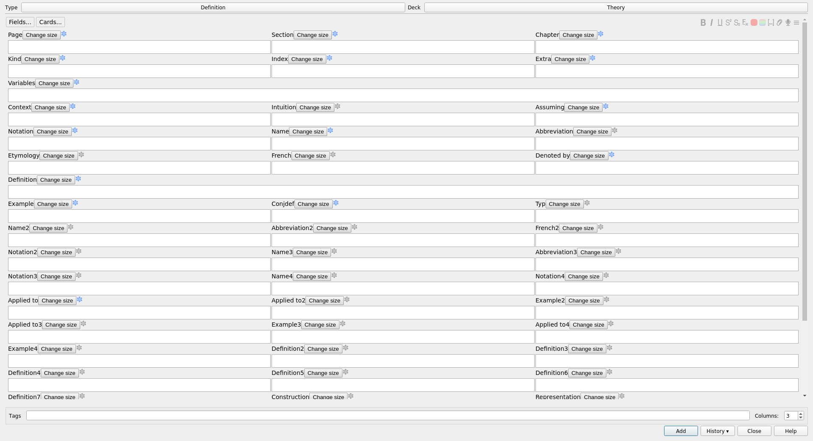

# Advanced Note Editor
## Description
This Anki add-on merges two add-ons:
* [Multi-column note editor](https://ankiweb.net/shared/info/3491767031) by HSSM. This add-on does not seems to be debugged anymore
* [Frozen fields](https://ankiweb.net/shared/info/516643804) by Tiago Barroso and Aristotelis P.

Those add-ons seems to be incompatible, and creating a third add-on seems to be the easier way to have both properties.

### Multi column note editor

Use multiple columns in the note editor. You can easily change the number of columns shown using the *Columns* field added by the add-on, and you can have a different number of columns for different note types and window types (browser, note adder, etc).

If you have any fields that take up a lot of space, you can configure them to take up an entire row.

Note that the configuration is saved in the collection. Thus, the configuration should be shared from a computer to another one.

### Frozen fields
Anki supports '''sticky fields'''. A sticky field is a field whose value is not deleted when you switch to a different note. This can be very useful if you are making many notes in which a field either has the '''same value''' or changes very little.

Unfortunaly, marking a field as sticky is quite complex and breaks your workflow. Frozen Fields allows you to conveniently mark a field as sticky (freeze) or not sticky (unfreeze) '''right from the note editor'''. It’s much more convenient than the default way.

To freeze/unfreeze a field, just '''click the adjacent snowflake''' or use the corresponding '''hotkey''' (F9 by default). A blue snowflake means that the field is frozen and a grey snowflake means that the field is unfrozen.

## Warning
If you install this add-on, uninstall the add-on Frozen Fields and Multi column note editor. The result otherwise would be unpredictable.

## TODO:
More beautiful buttons.

## Links, licence and credits

Key         |Value
------------|-------------------------------------------------------------------
Maintener   | Arthur Milchior <arthur@milchior.fr>
Based on:    | Anki code by Damien Elmes <anki@ichi2.net>
and Multi-column| [Multi-column note editor](https://ankiweb.net/shared/info/3491767031) by HSSM and
and Frozen field| [Frozen fields](https://ankiweb.net/shared/info/516643804) by Tiago Barroso and Aristotelis P.
License     | GNU AGPL, version 3 or later; http://www.gnu.org/licenses/agpl.html
Source in   | https://github.com/Arthur-Milchior/anki-Multi-column-edit-window
Addon number| [2064123047](https://ankiweb.net/shared/info/2064123047)
Support me on|  or 
